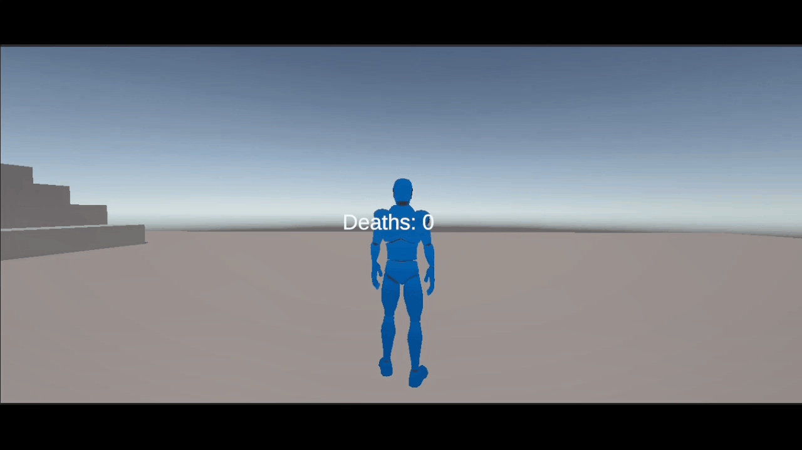

# Shadow Trial

Shadow Trial is a 3D platformer made in Unity for a university assignment. The goal is to reach the end of the level as fast as possible while avoiding traps, falling hazards, and other obstacles.

## Demo

## Gameplay

- Explore a 3D obstacle course.
- Reach checkpoints to update the respawn position.
- Avoid traps, projectiles, falling platforms, pushing walls, and kill zones.
- Finish the level and save your result with a nickname.
- Results are ranked by completion time and death count.

## Controls

- `WASD` - move
- `Mouse` - look around
- `Space` - jump
- `Esc` - pause

## Features

- Third-person character controller
- Mouse-controlled camera
- Jumping, falling, landing, and footstep audio
- Checkpoint-based respawn system
- Death counter and run timer
- Pause menu with restart and return-to-menu options
- Main menu with leaderboard and How to Play panel
- End screen with nickname input and score saving
- Local leaderboard stored with Unity `PlayerPrefs`
- Trap systems including projectile traps, falling platforms, and pushing walls
- Styled UI for main menu, pause menu, HUD, death screen, leaderboard, and score saving

## Scenes

- `MainMenu` - main menu, leaderboard, and How to Play screen
- `Level01` - playable level

## Tech Stack

- Unity
- C#
- TextMeshPro
- Unity Input System